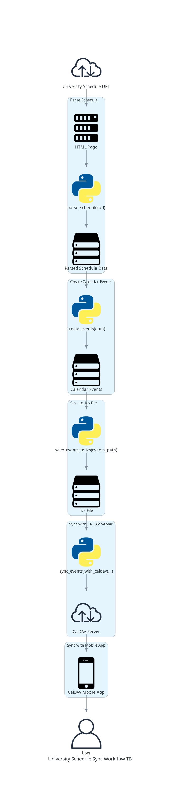

# University Schedule to CalDAV Sync

This project provides a Python script to parse a university schedule from a website, create calendar events, and sync them with a CalDAV server. The script can be used to automate the process of updating your calendar with your university schedule.

## Table of Contents

- [Features](#features)
- [Prerequisites](#prerequisites)
- [Installation](#installation)
- [Configuration](#configuration)
- [Usage](#usage)
- [Workflow Diagram](#workflow-diagram)
- [License](#license)

---

## Features

- Parses the university schedule from a given URL.
- Creates calendar events (`VEVENT`) from the parsed schedule data.
- Saves the created events to an `.ics` file.
- Syncs the `.ics` file with a CalDAV server.
- Supports syncing with mobile CalDAV apps.

---

## Prerequisites

- Python 3.x
- Required Python libraries: `requests`, `beautifulsoup4`, `icalendar`, `caldav`, `pytz`
- A running CalDAV server (e.g., Radicale)
- A mobile CalDAV app (e.g., DAVx⁵, Etar Calendar)

---

## Installation

1. **Clone the Repository:**

```bash
git clone https://github.com/yourusername/university-schedule-to-caldav.git
cd university-schedule-to-caldav
```

2. **Install Required Libraries:**

```bash
pip install requests beautifulsoup4 icalendar caldav pytz
```

---

## Configuration

1. **CalDAV Server:**
   - Ensure your CalDAV server (e.g., Radicale) is running and accessible.
   - Note the CalDAV server URL, username, and password.

2. **Mobile CalDAV App:**
   - Install a CalDAV app on your mobile device (e.g., DAVx⁵, Etar Calendar).
   - Configure the app with the CalDAV server URL, username, and password.

---

## Usage

1. **Run the Script:**

```bash
python sync_schedule.py
```

2. **Script Workflow:**
   - The script will parse the university schedule from the provided URL.
   - It will create calendar events from the parsed schedule data.
   - It will save the created events to an `.ics` file.
   - It will sync the `.ics` file with the CalDAV server.
   - The mobile CalDAV app will sync with the CalDAV server to display the calendar events.

---

## Workflow Diagram

The following diagram illustrates the whole workflow:

<div align="center">
  
</div>


## License

This project is licensed under the MIT License. See the [LICENSE](LICENSE) file for more details.
