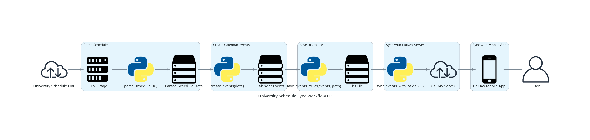
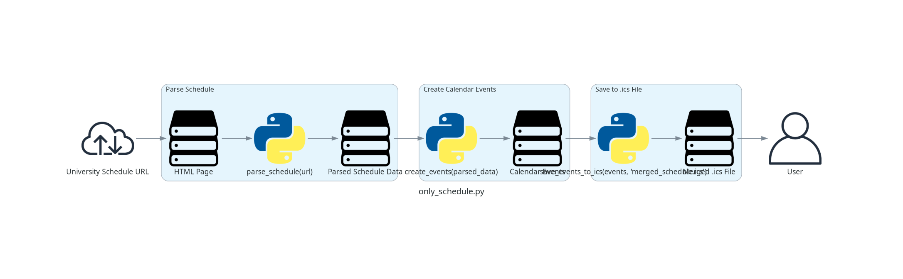
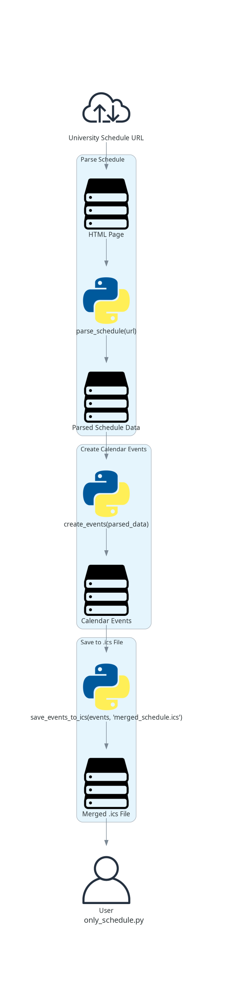

# University Schedule to CalDAV Sync

This project provides Python scripts to parse a university schedule from a website, create calendar events, and either sync them with a CalDAV server or export them to a standalone `.ics` file.

## Table of Contents

- [Features](#features)
- [Prerequisites](#prerequisites)
- [Installation](#installation)
- [Configuration](#configuration)
- [Usage](#usage)
- [Workflow Diagram](#workflow-diagram)
- [License](#license)

---

## Features

- Parses the university schedule from a given URL (e.g., [example weekly schedule](https://programm.fdiba.tu-sofia.bg/de/?q=plan_group&week=12&group=325) and [example exam schedule](https://tu-sofia.bg/examsfiles/%D0%A4%D0%B0%D0%93%D0%98%D0%9E%D0%9F%D0%9C-%D0%9A%D0%A1%D0%A2%D0%9D%D0%95--potok-17-kurs-3_1.html)).
- Creates calendar events (`VEVENT`) from the parsed schedule data.
- Saves the created events to an `.ics` file.
- **Full Sync**: Syncs the `.ics` file with a CalDAV server.
- **Standalone Export**: Generates a merged `.ics` file without requiring CalDAV or syncing.

---

## Prerequisites

- Python 3.x
- Required Python libraries:
  - `requests`
  - `beautifulsoup4`
  - `icalendar`
  - `pytz`
  - `caldav` *(only for CalDAV sync mode)*

---

## Installation

1. **Clone the Repository:**

   ```bash
   git clone https://github.com/dobval/Scrape-Schedule-CalDav-Sync.git
   cd Scrape-Schedule-CalDav-Sync
   ```

2. **Install Dependencies:**

   **Full Sync:**
   ```bash
   pip install requests beautifulsoup4 icalendar caldav pytz
   ```

   **Standalone Export only:**
   ```bash
   pip install requests beautifulsoup4 icalendar pytz
   ```

---

## Configuration

1. **Base URL & Group:**
   - Edit the `base_url` and `group` variables at the top of `sync_schedule.py` and `only_schedule.py` to match your timetable URL and group number.
2. **CalDAV Server (Full Sync only):**
   - Ensure your CalDAV server (e.g., Radicale) is running and accessible.
   - Note the CalDAV server URL, username, and password.

3. **Mobile CalDAV App (Full Sync only):**
   - Install a CalDAV app on your mobile device (e.g., DAVx⁵, Etar Calendar).
   - Configure the app with the CalDAV server URL, username, and password.

---

## Usage

### Full Sync (`sync_schedule.py`)

```bash
python sync_schedule.py
```

Prompts for CalDAV credentials, parses upcoming semester weeks, and syncs events to the CalDAV server.

### Standalone Export (`only_schedule.py`) (`only_exams.py`)

```bash
python only_schedule.py
```
Fetches the defined weeks, merges all parsed lectures into a single calendar, and writes `merged_schedule.ics` to the current directory. No CalDAV server required.

```bash
python only_exams.py
```
Writes `merged_exams_<group>.ics`. Can be called with an argument as the group number or the script will prompt otherwise.

---

## Workflow Diagram

The following diagrams illustrate both modes:



<details>
<summary>Sync Workflow TB</summary>
<p align="center">
  
</p>
</details>



<details>
<summary>Standalone Export Workflow TB</summary>
<p align="center">
  
</p>
</details>

---

## License

This project is licensed under the MIT License. See the [LICENSE](LICENSE) file for more details.

